# Knowledge-Base — Architecture

Cloud-first KB service: ingest from Google Drive via api-gateway, store vectors in PostgreSQL (pgvector), hybrid retrieval (dense + FTS → RRF → Voyage rerank).

**Color key:** 🔵 Caller  |  🟢 Routes  |  🌿 RAG / Search  |  🟡 Ingest  |  🟣 LLM Gateway  |  💙 Database  |  🟠 External

```mermaid
flowchart TB
    classDef caller    fill:#dbeafe,stroke:#3b82f6,color:#1e3a8a,font-weight:bold
    classDef router    fill:#ccfbf1,stroke:#14b8a6,color:#134e4a,font-weight:bold
    classDef ragNode   fill:#d1fae5,stroke:#10b981,color:#064e3b,font-weight:bold
    classDef ingest    fill:#fef9c3,stroke:#ca8a04,color:#713f12,font-weight:bold
    classDef llmNode   fill:#ede9fe,stroke:#8b5cf6,color:#3b0764
    classDef dbNode    fill:#e0e7ff,stroke:#6366f1,color:#1e1b4b,font-weight:bold
    classDef extNode   fill:#ffedd5,stroke:#f97316,color:#7c2d12,font-weight:bold

    subgraph CALLER["  Caller  "]
        gw_proxy["api-gateway\n/kb/* proxy"]
    end

    subgraph KB["  Knowledge-base Service — FastAPI  "]

        subgraph ROUTES["  Routes — /v1/* (auth required)  "]
            r_health["/health — public"]
            r_llm["/chat/completions · /models"]
            r_search["/kb/search · /kb/stats"]
            r_ingest["/kb/sync · /kb/sources\n/kb/files · DELETE /kb"]
            r_cfg["/config — GET · PATCH"]
        end

        subgraph RAG["  Search — RAG Pipeline  "]
            qproc["query_processor\noptional LLM query expansion\nvia gateway before embed"]
            retriever["retriever\ndense_search  HNSW cosine\n+ fts_search  GIN plainto_tsquery\n→ RRF fusion  k=60"]
            embedder["embedder\nembed_query · embed_documents\nVoyage AI  ·  batch size 96\nasyncio.to_thread"]
            reranker["reranker\nVoyage rerank-2.5\nasyncio.to_thread"]
        end

        subgraph INGEST["  Ingest Pipeline  "]
            sync["sync.py — sync_drive\nincremental by default\nforce=True re-syncs all"]
            loader["loader\nlist_drive_files · download_file\nparse: PDF · DOCX · text\nCSV · markdown · xlsx"]
            chunking["chunking\nlangchain-text-splitters"]
        end

        subgraph LLM["  LLM Gateway  "]
            ai_gw["llm/gateway.py — AIGateway\nsynchronous httpx client\n→ /ai/v1/chat/completions"]
        end

    end

    subgraph DB["  PostgreSQL + pgvector  "]
        chunks[("kb_chunks\ncontent · embedding vector(1024)\nfts tsvector (auto) · source_category\ndrive_file_id · filename · chunk_index\nIndex: HNSW · GIN · btree")]
        sources[("kb_sources\nfile_id PK · filename · category\nmodified_time · last_synced\nchunk_count · status")]
    end

    GW["api-gateway\nAPI_GATEWAY_URL + X-API-Key"]
    VOYAGE["Voyage AI\nembed-2 · rerank-2.5"]

    gw_proxy --> r_search
    gw_proxy --> r_ingest

    r_search --> qproc
    qproc -->|"optional"| ai_gw
    r_search --> retriever
    retriever --> embedder
    retriever --> reranker
    reranker -->|"threshold filter → top_k"| retriever

    ai_gw -->|"POST /ai/v1/chat/completions"| GW
    embedder -->|"embed_query / embed_documents"| VOYAGE
    reranker -->|"rerank-2.5"| VOYAGE

    r_ingest --> sync
    sync -->|"GET /storage/files\n(all 5 KB subfolders)"| GW
    sync --> loader
    loader -->|"GET /storage/files/{id}/content"| GW
    loader --> chunking
    chunking --> embedder
    sync -->|"atomic: DELETE old + INSERT new"| chunks
    sync -->|"upsert on sync"| sources

    class gw_proxy caller
    class r_health,r_llm,r_search,r_ingest,r_cfg router
    class qproc,retriever,embedder,reranker ragNode
    class sync,loader,chunking ingest
    class ai_gw llmNode
    class chunks,sources dbNode
    class GW,VOYAGE extNode

    style CALLER  fill:#eff6ff,stroke:#3b82f6,color:#1e3a8a
    style KB      fill:#f8fafc,stroke:#cbd5e1,color:#0f172a
    style ROUTES  fill:#f0fdfa,stroke:#14b8a6,color:#134e4a
    style RAG     fill:#ecfdf5,stroke:#10b981,color:#064e3b
    style INGEST  fill:#fefce8,stroke:#ca8a04,color:#713f12
    style LLM     fill:#faf5ff,stroke:#8b5cf6,color:#3b0764
    style DB      fill:#eef2ff,stroke:#6366f1,color:#1e1b4b
```

---

### Search flow — `POST /v1/kb/search`

1. **Query expansion** *(optional, `expand_query=true`)*: `QueryProcessor` calls `AIGateway.chat()` → gateway `/ai/v1/chat/completions` → expanded query string.
2. **Embed**: `embed_query(query)` → Voyage AI (sync, `asyncio.to_thread`).
3. **Dense search**: pgvector HNSW cosine similarity, top `rerank_candidates` rows.
4. **FTS search**: PostgreSQL `plainto_tsquery` on `fts` GIN index, top `rerank_candidates` rows. Skipped if `sparse_weight = 0`.
5. **RRF fusion**: Reciprocal Rank Fusion (`k=60`) merges dense + FTS ranked lists.
6. **Rerank**: Voyage `rerank-2.5` re-scores fused candidates (sync, `asyncio.to_thread`).
7. **Filter**: drop chunks below `similarity_threshold`, return top `top_k`.

### Sync flow — `POST /v1/kb/sync`

| Step | Detail |
|---|---|
| **List** | `GET /storage/files` on gateway — returns files from all 5 KB subfolders (general, projects, purdue, career, reference) with category per file. |
| **Diff** | Compare against `kb_sources` by `file_id` + `modified_time`. Skip unchanged; mark removed files. |
| **Download** | `GET /storage/files/{id}/content` — gateway exports Google Docs/Sheets as plain text/xlsx. |
| **Parse** | PDF → PyPDF2, DOCX → python-docx, xlsx → openpyxl, text/CSV/markdown → raw. |
| **Chunk** | `chunk_text()` via langchain-text-splitters. |
| **Embed** | `embed_documents(chunks)` in batches of 96 → Voyage AI. |
| **Write** | Atomic transaction: `DELETE` old chunks for file → `INSERT` new chunks. Upsert `kb_sources`. |
| **Delete** | Files no longer in Drive: delete chunks, mark `kb_sources.status = 'deleted'`. |
