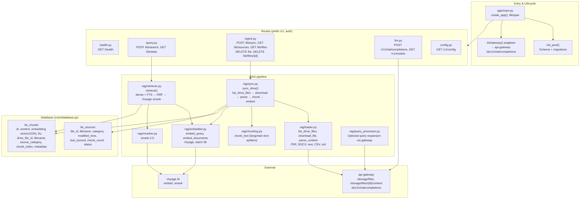

# Knowledge Base — Detailed Architecture

Specific structure: app lifecycle, routes, RAG pipeline, and database schema.

**Key modules:**

| Module           | Role |
|------------------|------|
| `app/main.py`    | Lifespan: init_pool, AIGateway; mounts health, llm, query, ingest, config |
| `core/database.py` | asyncpg pool, kb_chunks + kb_sources schema, migrations |
| `core/config.py` | AppConfig (DATABASE_URL, VOYAGE_*, API_GATEWAY_*, etc.) |
| `rag/sync.py`    | Full/incremental Drive → kb_sources + kb_chunks |
| `rag/retriever.py` | Hybrid search: dense (HNSW) + FTS → RRF → rerank → threshold |
| `llm/gateway.py` | AIGateway: all LLM calls go to api-gateway |
