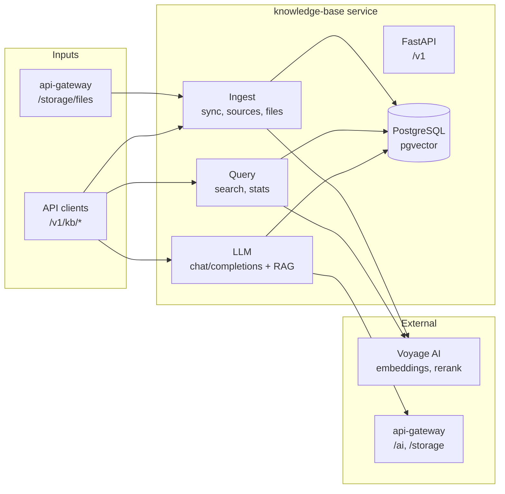

# Knowledge Base — Architecture Overview

High-level view for quickly understanding the codebase.

**In one sentence:** FastAPI service that syncs documents from the gateway’s Drive, embeds and stores them in Postgres+pgvector, and exposes search and an OpenAI-compatible chat with RAG.
